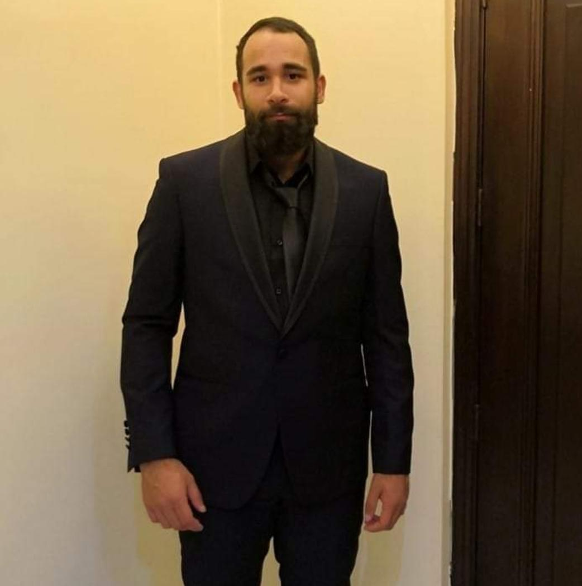

# **Hussein Ayoub**

## **Telecommunication Engineer**



```
Email: Hussein-ayoub-96@hotmail.com

Phone Number: +961-71-313853

Place: Nadeem Choueiri Street
Beirut, Hadath
 
LinkedIn Account: https://www.linkedin.com/in/hussein-ayoub-2b6333189

```
>Skills:
>
>Simulation (Atoll, HFSS, Math Lab, LabVIEW), Programming (C++, HTML5, CSS, JavaScript, Notepad++, Assembly Language), Networking (Cisco packet tracer), Soft skill (leadership, emotional intelligence, interpersonal strengths, organizational, creative, behavior traits, communication styles)


### **EDUCATION**
---

Bachelor’s Degree in Telecommunication Engineering
Beirut Arab University, Debbieh │2014-2019

Baccalaureate General Science
Charity high school, Beirut │2014

#### **Project And Internship**
---

#### **Telecommunication Engineer intern**

OGERO, Birr Hassan │July-September 2018
-Copper characteristics used to transmit the signal, telecommunication network equipment in Lebanon 
-Hardware Faults & Hardware Supervision

#### **Senior Project**

Beirut Arab University, Debbieh │September-May 2019
“Beam Forming Butler Matrix”
-Miniaturization of a 4x4 Butler matrix taken from a paper
-Simulation of the compact matrix 
-Calculation and development of compact butler matrix

#### Study Project

Beirut Arab University, Debbieh │March-May 2018
“Antenna Characterization”
Measuring Horn antenna’s parameters and plot the radiation pattern.

Zaka AI Bootcamp, Beirut │March-April 2021
“Hand Gesture Recognition”
Apply convolutional neural network (CNN) algorithm to a deep learning model in order to classify sign language digits [0-9] from images.

#### Study Course

Beirut Arab University, Debbieh │October-December 2017
“Building shopping Website using html, CSS and JavaScript codes”

#### **Study Course**

Beirut Arab University, Debbieh │October-December 2018
“Developing a simulator to investigate the impact of wireless communication on the health of subscribers “
-Calculation of the power density at different points in a cellular network 
-Comparison of the density to the ICNIRP standard.

### **Certification and Courses**
---
*	Artificial Intelligence certification
*	Courses equivalent to CCNA certification

### **Interest And Activities**
---

*	Football, Ping Pong, Adventures

